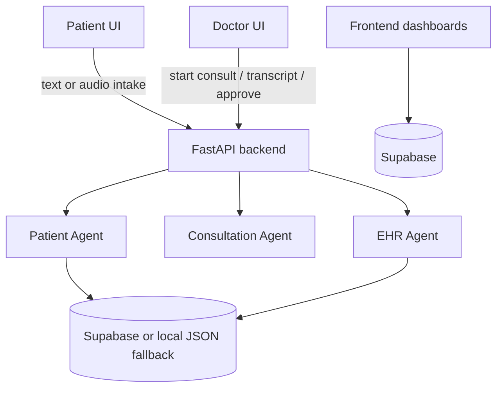

Contributors:
* [@phanindragollapalli](https://github.com/phanindragollapalli)
* [@anonymousghost9999](https://github.com/anonymousghost9999)
* [@rider9600](https://github.com/rider9600)
* [@YVKartikeya9](https://github.com/YVKartikeya9)

Note : All four of us contributed equally in this project and we are planning to expand this project.
# MediAgent

MediAgent is a doctor-in-the-loop hospital workflow and EHR system with an AI-assisted intake and consultation pipeline.

The project has two major parts:

- A React 19 + TanStack frontend for patients, doctors, and admins
- A FastAPI backend that runs the AI orchestration pipeline for intake, transcription, clinical extraction, safety review, and EHR compilation

It is designed around a simple idea: AI can prepare and organize clinical information, but a doctor remains the approving authority before anything becomes part of the final record.

## What The App Does

MediAgent supports a complete consultation flow:

1. A patient signs in and starts a new consultation.
2. The patient describes symptoms by text or audio.
3. The backend patient agent triages the case, asks follow-up questions, and produces a structured intake summary.
4. The doctor sees the case in the dashboard and opens the consultation workspace.
5. The doctor records or types consultation notes.
6. The backend consultation agent extracts diagnosis candidates, medications, tests, and follow-up suggestions from the conversation.
7. The doctor reviews and edits the IM report.
8. The backend EHR agent validates and persists the final record, performs a medication safety audit, creates discharge instructions, and updates the timeline.

## Architecture Overview



## Repository Structure

```text
mediagent/
├── backend/
│   ├── app/
│   │   ├── main.py
│   │   ├── config.py
│   │   ├── database.py
│   │   └── services/
│   │       ├── orchestrator.py
│   │       ├── patient_agent.py
│   │       ├── consultation_agent.py
│   │       ├── ehr_agent.py
│   │       └── llm_service.py
│   ├── requirements.txt
│   └── supabase_schema.sql
├── src/
│   ├── routes/
│   ├── components/
│   ├── hooks/
│   ├── integrations/supabase/
│   └── lib/
├── scripts/dev.mjs
└── package.json
```

## Tech Stack

### Frontend

- React 19
- Vite
- TanStack Router
- TanStack Query
- Tailwind CSS
- shadcn/ui
- Supabase JS client

### Backend

- FastAPI
- Pydantic
- Uvicorn
- `httpx`
- Supabase Python client

### AI And Speech Services

- OpenRouter using `google/gemini-2.5-flash`
- Sarvam STT for speech-to-text
- Sarvam translation
- Sarvam TTS for voice responses

## How The Implementation Works

### 1. Frontend routing and role-based UX

The app is organized by role:

- Patient routes under `src/routes/patient.*`
- Doctor routes under `src/routes/doctor.*`
- Admin routes under `src/routes/admin.*`

The root route redirects users to a role-specific home after login. Authentication in the current implementation is lightweight:

- Regular users are looked up in the `profiles` table
- Session state is stored in local storage through [`src/hooks/use-auth.tsx`](/home/phanindra/Desktop/Projects/mediagent/src/hooks/use-auth.tsx)
- There is also a hardcoded admin login in [`src/routes/auth.tsx`](/home/phanindra/Desktop/Projects/mediagent/src/routes/auth.tsx)

Important implementation detail:

- The frontend reads most operational data directly from Supabase
- The AI actions themselves call the FastAPI backend through [`src/lib/api/client.ts`](/home/phanindra/Desktop/Projects/mediagent/src/lib/api/client.ts)

That means the backend's local JSON fallback is useful for backend development, but the full frontend experience still expects a working Supabase project.

### 2. Backend API layer

[`backend/app/main.py`](/home/phanindra/Desktop/Projects/mediagent/backend/app/main.py) exposes the FastAPI endpoints.

Main endpoints:

- `POST /api/intake`
- `POST /api/intake-audio`
- `GET /api/patients`
- `GET /api/patients/{patient_id}/timeline`
- `POST /api/consult/start`
- `POST /api/consult/transcribe-extract`
- `POST /api/consult/text-extract`
- `POST /api/consult/session-summary`
- `POST /api/consult/hpi-summary`
- `POST /api/consult/approve`

The API layer is thin. It mostly:

- validates request payloads
- loads files or form data
- calls the orchestrator
- returns structured JSON to the frontend

### 3. Orchestrator flow

[`backend/app/services/orchestrator.py`](/home/phanindra/Desktop/Projects/mediagent/backend/app/services/orchestrator.py) coordinates the high-level flow.

It has four core stages:

1. `orchestrate_patient_intake`
   Saves the patient profile, runs the patient agent, and prepares intake data.
2. `orchestrate_start_consultation`
   Marks the case as in consultation and appends a timeline event.
3. `orchestrate_dialogue_processing`
   Resolves patient language and runs the consultation extraction pipeline.
4. `orchestrate_finalize_consultation`
   Loads the existing longitudinal record and hands everything to the EHR agent for final persistence.

This separation is helpful because each stage has different inputs, side effects, and failure modes.

### 4. Patient agent

[`backend/app/services/patient_agent.py`](/home/phanindra/Desktop/Projects/mediagent/backend/app/services/patient_agent.py) handles pre-consultation intake.

What it does:

- loads the patient profile and previous consultations
- optionally transcribes audio with Sarvam STT
- translates non-English input into English
- reconstructs prior intake chat turns from the timeline
- prompts the LLM to:
  - identify the chief complaint
  - detect missing intake fields
  - ask one follow-up question at a time
  - generate differential diagnoses
  - assign an ESI-style severity score
- stores both patient and assistant chat turns on the timeline
- optionally converts the assistant response to audio with Sarvam TTS
- writes a structured intake summary into the consultation record

The patient agent is not just generating a summary. It behaves like a guided structured interview that decides whether intake is complete.

### 5. Consultation agent

[`backend/app/services/consultation_agent.py`](/home/phanindra/Desktop/Projects/mediagent/backend/app/services/consultation_agent.py) processes the doctor-patient conversation after intake.

What it does:

- accepts audio or plain text notes
- transcribes audio with Sarvam if needed
- normalizes the transcript into English
- asks the LLM to filter small talk and extract clinical facts
- returns:
  - original transcript
  - English transcript
  - symptoms
  - diagnosis
  - ICD-10 code
  - prescribed drugs
  - tests and investigations
  - follow-up

This output is used to prefill the doctor workspace.

### 6. EHR agent

[`backend/app/services/ehr_agent.py`](/home/phanindra/Desktop/Projects/mediagent/backend/app/services/ehr_agent.py) is the most important persistence layer in the system.

Its merge logic is explicit:

1. doctor edits win
2. consultation extraction is next
3. patient intake data is last

What it does:

- resolves whether the incoming identifier is a consultation ID or patient ID
- loads or initializes the longitudinal medical record
- validates ICD-10 format
- normalizes medications into a consistent structure
- appends a visit entry to treatment history
- updates active conditions
- merges allergy records
- archives old medications and sets current medications
- runs a non-blocking medication safety audit
- generates a translated discharge summary
- builds insurance pre-authorization metadata
- saves the finalized consultation
- saves the EHR record
- upserts the patient medical record
- updates patient status
- appends timeline events

This is where the project moves from "AI output" to "reviewed medical record."

### 7. LLM and translation service layer

[`backend/app/services/llm_service.py`](/home/phanindra/Desktop/Projects/mediagent/backend/app/services/llm_service.py) wraps all model and speech provider calls.

Responsibilities include:

- mapping language names to BCP-47 codes
- calling OpenRouter
- calling Sarvam speech-to-text
- contextual translation with LLM-first and Sarvam fallback
- text-to-speech generation
- OCR-style image parsing for medical documents
- robust JSON extraction from model output
- clinical prompts for:
  - intake reasoning
  - consultation extraction
  - drug safety checks
  - session summaries
  - HPI generation

The code prefers structured JSON prompts so downstream services can reliably consume model output.

### 8. Database and persistence model

[`backend/app/database.py`](/home/phanindra/Desktop/Projects/mediagent/backend/app/database.py) supports two storage modes:

- Supabase mode when `SUPABASE_URL` and `SUPABASE_KEY` are present
- local JSON fallback in `backend/db_fallback.json`

The fallback database stores:

- patients
- consultations
- timelines
- medical records
- ehr records

The Supabase schema reference is available in [`backend/supabase_schema.sql`](/home/phanindra/Desktop/Projects/mediagent/backend/supabase_schema.sql).

Core tables used by the app:

- `profiles`
- `consultations`
- `ehr_records`
- `timelines`
- `patient_medical_records`
- `audit_logs`
- `patient_agent_chats`

### 9. Doctor workspace behavior

The doctor consultation workspace in [`src/routes/doctor.consultations.$id.tsx`](/home/phanindra/Desktop/Projects/mediagent/src/routes/doctor.consultations.$id.tsx) combines three sources of data:

- patient intake report
- consultation agent output
- manual doctor edits

The page:

- auto-starts consultation status on first load
- supports live transcription through the browser Web Speech API
- sends transcript text to the backend for extraction
- auto-fills HPI, diagnosis, tests, and prescriptions where possible
- lets the doctor review and edit the IM report
- finalizes the consultation through `POST /api/consult/approve`

This is the main doctor-in-the-loop safety mechanism in the frontend.

## Current Data Flow

### Patient intake

1. Patient submits text or audio symptoms.
2. Frontend calls `/api/intake` or `/api/intake-audio`.
3. Patient agent transcribes or translates if required.
4. LLM returns structured intake analysis.
5. Patient profile, consultation row, and timeline are updated.
6. Doctor dashboard picks up the waiting case from Supabase.

### Doctor consultation

1. Doctor opens a consultation from the dashboard.
2. Frontend signals `/api/consult/start`.
3. Doctor records speech or writes notes.
4. Frontend sends transcript or audio to the consultation endpoint.
5. Backend returns extracted clinical facts.
6. UI pre-fills the report.
7. Doctor edits and approves.
8. Backend EHR agent persists final outputs and updates history.

## Setup

### Prerequisites

- Node.js 18+
- npm
- Python 3.11+
- A Supabase project
- OpenRouter API key
- Sarvam API key if you want speech, translation, or TTS

### Install dependencies

```bash
npm install
cd backend
pip install -r requirements.txt
cd ..
```

### Environment variables

Create a root `.env` file for the frontend:

```env
VITE_API_BASE_URL=http://127.0.0.1:8000
VITE_SUPABASE_URL=your_supabase_project_url
VITE_SUPABASE_PUBLISHABLE_KEY=your_supabase_publishable_key
```

Create `backend/.env` for the backend:

```env
OPENROUTER_API_KEY=your_openrouter_api_key
SARVAM_API_KEY=your_sarvam_api_key
SUPABASE_URL=your_supabase_project_url
SUPABASE_KEY=your_supabase_service_or_anon_key
```

Notes:

- The frontend will throw an error if Supabase env vars are missing.
- The backend can fall back to local JSON, but the full product experience still depends on Supabase-backed frontend queries.
- If `SARVAM_API_KEY` is missing, speech features will not work.
- If `OPENROUTER_API_KEY` is missing, AI extraction and reasoning features will fail.

### Database setup

Use [`backend/supabase_schema.sql`](/home/phanindra/Desktop/Projects/mediagent/backend/supabase_schema.sql) as the schema reference for your Supabase tables.

Before first use, make sure at minimum these tables exist and are queryable:

- `profiles`
- `consultations`
- `ehr_records`
- `timelines`
- `patient_medical_records` if you want longitudinal history in the doctor workspace

If your live Supabase project differs from the schema file, align the app queries before deployment.

## Running The App

### Start both frontend and backend

```bash
npm run dev
```

This starts:

- frontend on `http://localhost:8080`
- backend on `http://127.0.0.1:8000`

### Start them separately

```bash
npm run dev:frontend
npm run dev:backend
```

## User Guide

### Sign in and roles

The app supports three roles:

- patient
- doctor
- admin

Patients and doctors can sign up from the auth page. Admin uses a hardcoded login in the current implementation:

- Email: `admin@mediagent.com`
- Password: `Admin@1234`

### Patient guide

1. Open the app and create a patient account.
2. After login, go to the patient dashboard.
3. Click "Start new consultation".
4. Enter symptoms and related details.
5. If using supported voice flow, upload or record audio when the relevant screen exposes it.
6. Answer follow-up questions from the intake agent until intake is complete.
7. Wait for the doctor to review the case.
8. After approval, use:
   - Timeline to review consultation history
   - Treatments to monitor current care
   - Reports to review finalized outputs
   - Profile to keep patient information up to date

Important for patients:

- AI can ask clarifying questions before the record is complete.
- Final records are not considered approved until the doctor signs off.

### Doctor guide

1. Create a doctor account and sign in.
2. Open the doctor dashboard.
3. Review waiting intake records.
4. Open a consultation from the queue.
5. Review the intake report and patient context.
6. Start or continue the consultation.
7. Use live transcription or type notes manually.
8. Let the system extract symptoms, diagnosis candidates, tests, medications, and follow-up.
9. Review the IM report carefully.
10. Edit diagnosis, ICD-10, prescriptions, investigations, HPI, and notes as needed.
11. Approve the consultation.
12. Review safety alerts, discharge output, and timeline updates.

Important for doctors:

- The extracted content is draft assistance, not final truth.
- The doctor edit layer overrides AI-generated fields.
- Medication conflicts are treated as non-blocking alerts and should still be reviewed manually.

### Admin guide

Admin pages are present for dashboards, doctors, users, permissions, AI models, hospital settings, and audit logs.

Use the admin area to:

- review usage and system state
- inspect users and roles
- inspect audit-related views
- manage hospital and AI configuration screens

Because admin behavior is partly UI-driven and partly dependent on Supabase data, verify your backing tables before presenting it as production-ready.

## API Summary

### Patient and intake

- `POST /api/intake`
- `POST /api/intake-audio`
- `GET /api/patients`
- `GET /api/patients/{patient_id}/timeline`

### Consultation

- `POST /api/consult/start`
- `POST /api/consult/transcribe-extract`
- `POST /api/consult/text-extract`
- `POST /api/consult/session-summary`
- `POST /api/consult/hpi-summary`
- `POST /api/consult/approve`

## Known Implementation Notes

- Frontend auth is application-level and uses local storage, not full Supabase Auth.
- Admin login is hardcoded.
- The frontend expects Supabase env vars at startup.
- The backend local JSON mode is useful for isolated backend work, but not a full replacement for Supabase-backed UI behavior.
- Some doctor workspace features rely on browser speech recognition support.
- The repository contains schema and service code for richer workflows than the README originally described, so check table compatibility before deployment.

## Recommended First Test Run

If you want to validate the project end to end:

1. Configure Supabase and both `.env` files.
2. Start the app with `npm run dev`.
3. Create a patient account.
4. Submit a patient intake.
5. Create a doctor account in a second browser session.
6. Open the doctor dashboard and locate the waiting record.
7. Open the consultation, type notes, and finalize the report.
8. Return to the patient account and verify reports, treatments, and timeline data.

## Key Files To Read First

- [`README.md`](/home/phanindra/Desktop/Projects/mediagent/README.md)
- [`backend/app/main.py`](/home/phanindra/Desktop/Projects/mediagent/backend/app/main.py)
- [`backend/app/services/orchestrator.py`](/home/phanindra/Desktop/Projects/mediagent/backend/app/services/orchestrator.py)
- [`backend/app/services/patient_agent.py`](/home/phanindra/Desktop/Projects/mediagent/backend/app/services/patient_agent.py)
- [`backend/app/services/consultation_agent.py`](/home/phanindra/Desktop/Projects/mediagent/backend/app/services/consultation_agent.py)
- [`backend/app/services/ehr_agent.py`](/home/phanindra/Desktop/Projects/mediagent/backend/app/services/ehr_agent.py)
- [`backend/app/services/llm_service.py`](/home/phanindra/Desktop/Projects/mediagent/backend/app/services/llm_service.py)
- [`src/lib/api/client.ts`](/home/phanindra/Desktop/Projects/mediagent/src/lib/api/client.ts)
- [`src/routes/doctor.consultations.$id.tsx`](/home/phanindra/Desktop/Projects/mediagent/src/routes/doctor.consultations.$id.tsx)
- [`src/routes/patient.dashboard.tsx`](/home/phanindra/Desktop/Projects/mediagent/src/routes/patient.dashboard.tsx)

## License

No license file is currently included in this repository. Add one before public distribution.
