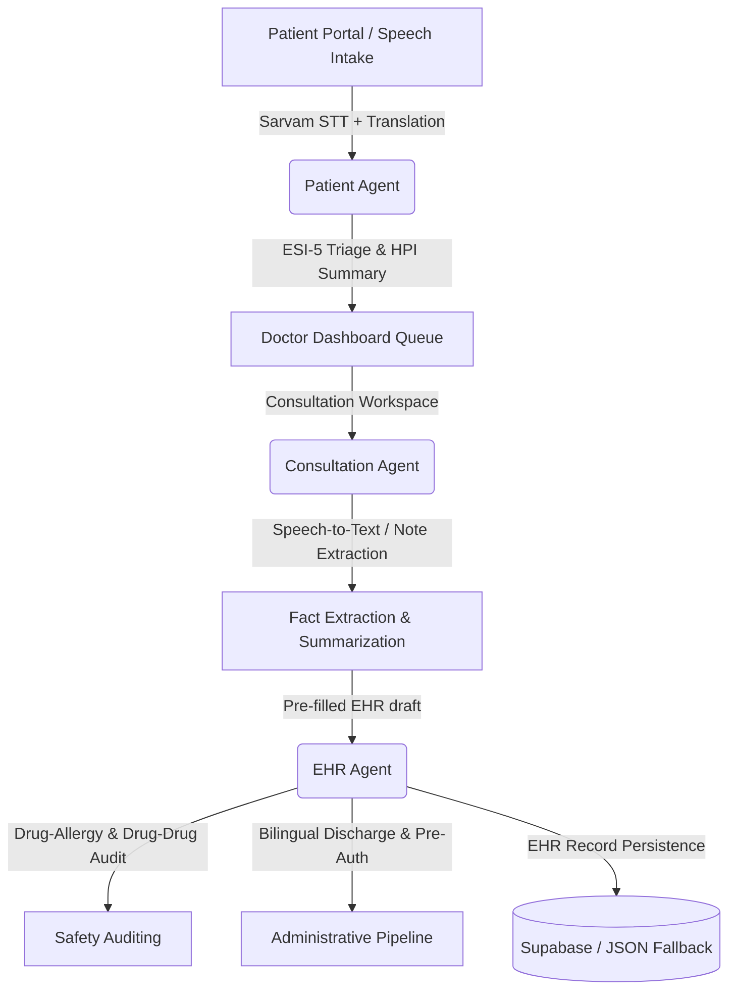

# 🩺 MediAgent

MediAgent is a state-of-the-art, agentic AI-powered hospital operations and EHR management platform. It streamlines clinical workflows and improves patient intake, doctor-patient consultations, and EHR maintenance. 

By combining a **React 19 frontend** with a **FastAPI backend**, MediAgent coordinates multiple specialised LLM agents using **OpenRouter (Google Gemini 2.5 Flash)** and **Sarvam SaaRAS V3 API** for multilingual clinical speech, translation, and voice synthesis.

---

## 🏗️ System & Agent Architecture

MediAgent uses a multi-agent orchestrator pipeline where each stage is handled by a specialized clinical AI agent:



### 1. 🤖 Patient Agent (Intake & Triage)
- **Multilingual Intake**: Collects patient symptoms and medical history via text or audio (supporting English, Hindi, and Telugu).
- **Clinical Triage (ESI-5)**: Evaluates vitals and chief complaints to compute a precise Emergency Severity Index (ESI) triage score (1 to 5) with clinical justification.
- **Differential Diagnoses**: Suggests at least three potential conditions with likelihood ratings and reasoning.
- **Safe Guidance**: Provides temporary care instructions while flagging urgent symptoms.

### 2. 📝 Consultation Agent (Speech-to-Clinical Facts)
- **Live Consultation Recording**: Transcribes doctor-patient dialogue in real-time using Web Speech APIs or uploads audio recorded files.
- **Multilingual Support**: Non-English audio or transcripts are automatically normalized to English via Sarvam translation.
- **Noise Filtering**: Ignores casual conversations, jokes, and small talk to extract clinical facts.
- **Auto-Mapping**: Directly pre-populates EHR sections (Chief Complaint, Vitals, Assessment, Plan, Prescriptions, Investigations, and Follow-up).

### 3. 🛡️ EHR Agent (Verification, Audit & Persistence)
- **Safety Auditing**: Cross-references new prescriptions against the patient's allergy history and current active medications to check for drug-allergy and drug-drug interactions.
- **Administrative Automation**: Drafts insurance pre-authorization requests including ICD-10 justification and proposed treatments.
- **Bilingual Discharge**: Translates finalized care and dosage instructions into the patient's preferred language using Sarvam Bulbul V3.
- **Longitudinal EHR Sync**: Compiles and saves the clinical record into the main `ehr_records` table and updates the patient's timeline queue.

---

## 📁 Repository Structure

```
mediagent/                           ← Repo root
├── backend/                         ← FastAPI Python backend
│   ├── app/
│   │   ├── main.py                  ← FastAPI app & endpoints
│   │   ├── config.py                ← Configuration & env variables loader
│   │   ├── database.py              ← Supabase ORM & JSON fallback DB
│   │   └── services/
│   │       ├── orchestrator.py      ← Pipelines coordinator
│   │       ├── patient_agent.py     ← Patient Intake & Triage agent
│   │       ├── consultation_agent.py ← Live speech clinical fact extractor
│   │       ├── ehr_agent.py         ← EHR compiler, safety auditor & pre-auth
│   │       └── llm_service.py       ← Core OpenRouter & Sarvam client APIs
│   └── requirements.txt             ← Python dependencies
├── src/                             ← React frontend
│   ├── routes/                      ← TanStack Router page routing
│   │   ├── doctor.dashboard.tsx     ← Doctor Dashboard Queue
│   │   ├── doctor.consultations.$id.tsx ← Doctor Workspace
│   │   ├── patient.dashboard.tsx    ← Patient Portal
│   │   └── auth.tsx                 ← Authentication page
│   ├── lib/api/client.ts            ← Frontend API client
│   └── integrations/supabase/       ← Supabase client connection scripts
├── .env                             ← Frontend environment variables
└── package.json                     ← NPM package scripts & packages
```

---

## 🛠️ Technology Stack

| Layer | Technology | Description |
|---|---|---|
| **Frontend** | React 19, Vite, TanStack Router | Component-based client with type-safe routing |
| **UI** | Tailwind CSS v4, shadcn/ui, Lucide | Sleek, modern dashboard with dark & light modes |
| **Backend** | FastAPI, Python 3.11+ | High-performance asynchronous API endpoints |
| **LLM Services** | OpenRouter (Gemini 2.5 Flash) | Handles diagnostic parsing, safety check, summaries |
| **Translation** | Sarvam Translation API | Contextual translation (Hindi / Telugu / English) |
| **Voice / Speech** | Sarvam Saaras (STT) & Bulbul (TTS) | Real-time speech transcription & vocal synthesis |
| **Database** | Supabase (PostgreSQL) | Primary hosted cloud database |
| **Fallback DB** | Local JSON (`db_fallback.json`) | Allows full offline development without Supabase |

---

## 🔌 API Endpoints

### 🩺 Intake & Patient Operations
* **`POST /api/intake`**: Submits text symptoms and returns the Patient Agent's intake report.
* **`POST /api/intake-audio`**: Transcribes uploaded voice recording and triggers Patient Agent triage.
* **`GET /api/patients`**: Returns the patient list sorted by triage severity.
* **`GET /api/patients/{patient_id}/timeline`**: Fetches the patient's EHR timeline.

### 👨‍⚕️ Consultation Workspace
* **`POST /api/consult/start`**: Moves patient status from `waiting` to `in_consultation` and updates timeline.
* **`POST /api/consult/transcribe-extract`**: Transcribes recorded consultation audio file and extracts clinical summary.
* **`POST /api/consult/text-extract`**: Extracts clinical summary directly from text notes.
* **`POST /api/consult/session-summary`**: Generates a summary (findings, patient instructions, risk flags) from the transcript.
* **`POST /api/consult/hpi-summary`**: Writes a History of Present Illness (HPI) paragraph from the intake report.
* **`POST /api/consult/approve`**: Compiles and finalizes the EHR. Runs the safety audit, bilingual discharge, and pre-auth pipelines. Sets consultation status to `completed`.

---

## 💾 Database Schema

MediAgent operates with a relational PostgreSQL database (primarily hosted on Supabase). The core tables are defined as follows:

1. **`profiles`**: Stores user registration profiles, roles (`patient`, `doctor`, `admin`), demographics, allergies, and chronic conditions.
2. **`consultations`**: Tracks diagnostic encounters, containing triage notes, symptoms, transcript text, medical summaries, and statuses (`waiting`, `in_consultation`, `completed`).
3. **`ehr_records`**: Holds finalized clinical records including finalized diagnoses, ICD-10 codes, prescriptions, safety alert flags, treatment statuses, and bilingual discharge instructions.
4. **`timelines`**: Appends historical events (intake, consultation starts, safety alerts) in chronological order for the patient's timeline record.
5. **`patient_agent_chats`**: Preserves chat logs of the patient's initial triage conversation with the intake AI.
6. **`audit_logs`**: Logs all clinical actions (EHR finalizations, prescription adjustments, safety audits) for administrative auditing.

---

## 🚀 Installation & Local Development

### 1. Prerequisites
- **Node.js** (v18 or higher)
- **Python** (v3.11 or higher)
- A **Supabase project** (optional - runs in local JSON fallback mode if not provided)

### 2. Install Dependencies
```bash
# Clone the repository and install npm packages
git clone https://github.com/anonymousghost9999/mediagent.git
cd mediagent
npm install --legacy-peer-deps

# Install Python requirements
cd backend
pip install -r requirements.txt
cd ..
```

### 3. Configure Environment Variables
Configure the environment variables by creating `.env` files.

Create a **`backend/.env`** file:
```env
# OpenRouter API Key (Required for AI Agents)
OPENROUTER_API_KEY=your_openrouter_api_key

# Sarvam API Key (Required for speech & translation)
SARVAM_API_KEY=your_sarvam_api_key

# Supabase Credentials (Optional - fallbacks to local JSON db if empty)
SUPABASE_URL=https://your-project.supabase.co
SUPABASE_KEY=your_supabase_anon_key
```

Create a root **`.env`** file (pre-configured):
```env
VITE_API_BASE_URL=http://127.0.0.1:8000
```

### 4. Running the Dev Server
Launch the React frontend and FastAPI backend concurrently:
```bash
npm start
```
- Frontend dev server starts at: `http://localhost:8080`
- FastAPI server starts at: `http://127.0.0.1:8000`